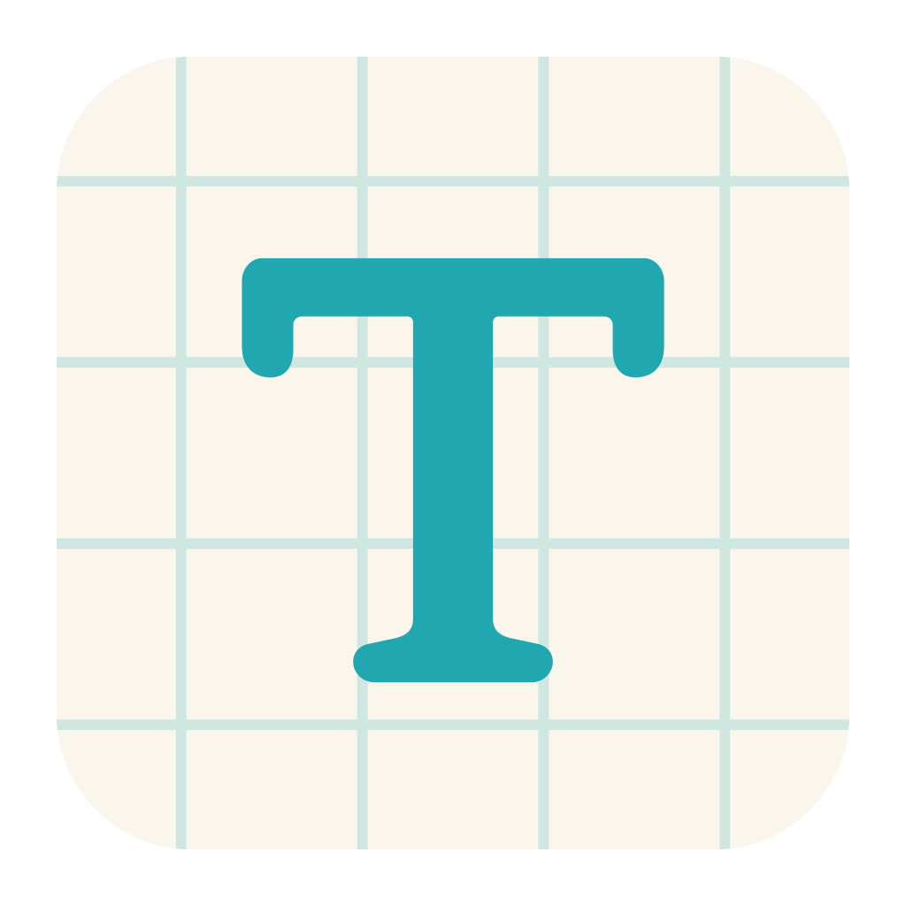
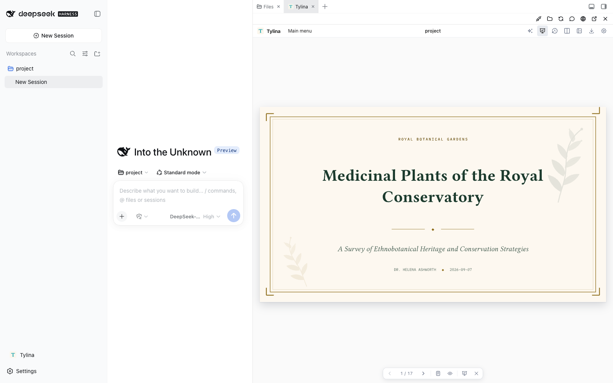
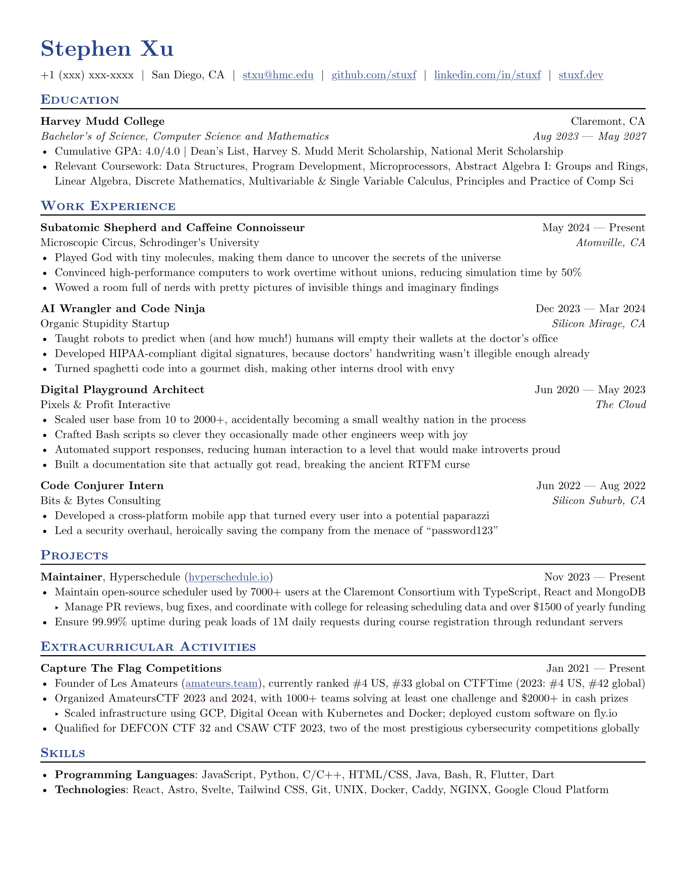
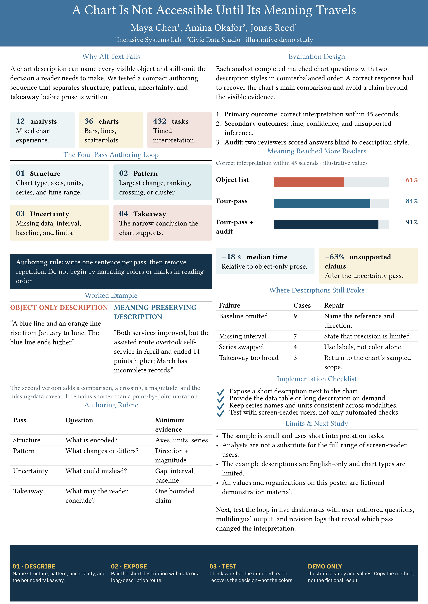
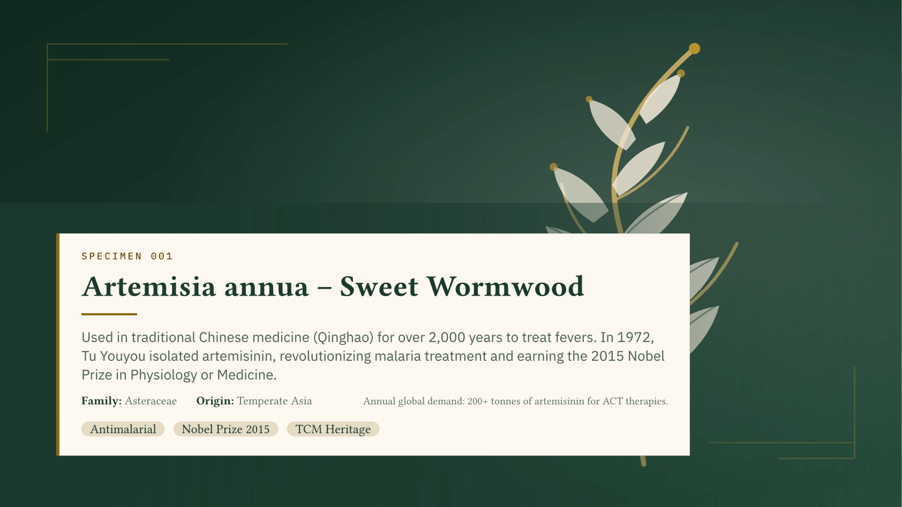
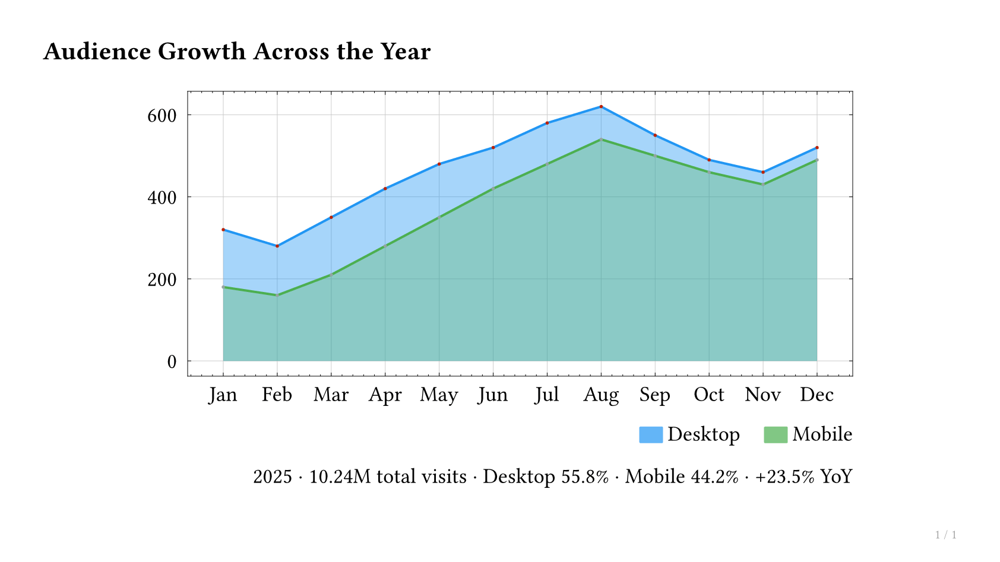
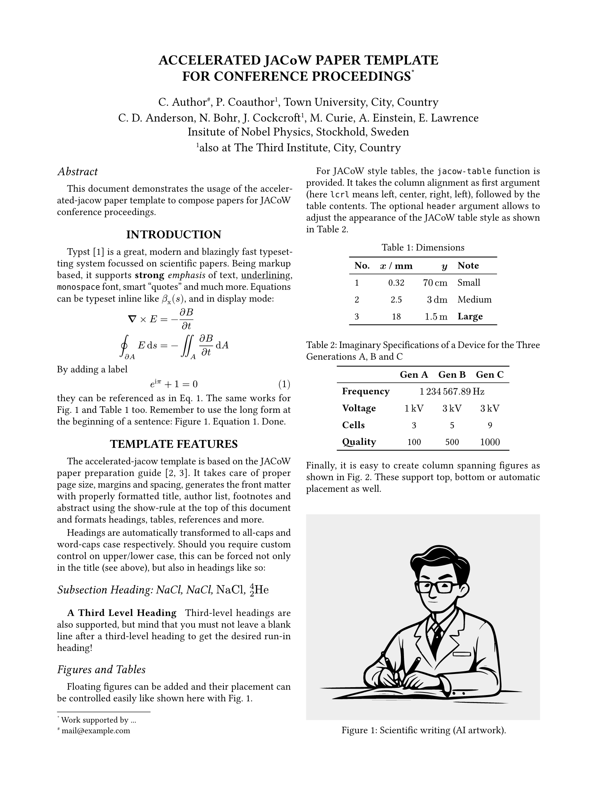
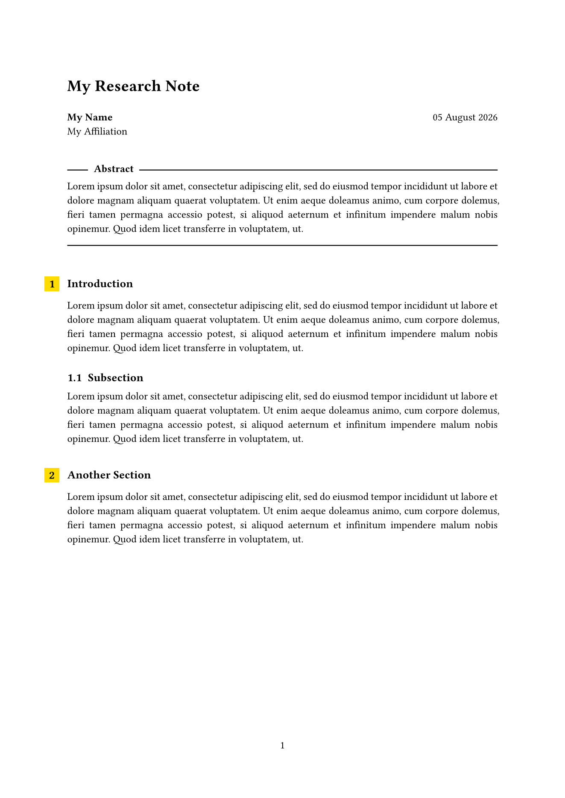
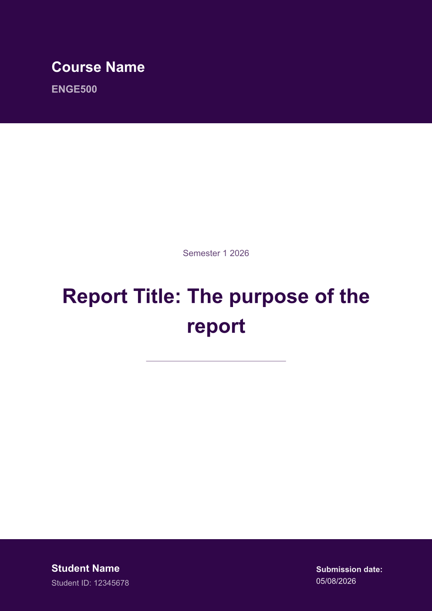

<p align="center"></p>
<h1 align="center">Tylina for DeepSeek Harness</h1>
<p align="center"><strong>把精美的文档，写进你的 Agent 工作流。</strong></p>
<p align="center"><a href="README.md">English</a> · <strong>简体中文</strong></p>
<p align="center"><a href="https://tylina.github.io/">官网</a> · <a href="https://tylina.github.io/app/">体验 Web 版</a> · <a href="#安装与更新">安装</a></p>

在 DeepSeek Harness 中直接编辑排版后的 Typst 文档。与 Agent 共用工作区，从初稿、设计到 PDF 交付。



- **直接编辑成品**：点击排版后的页面写作；需要精细控制时，切换 Split 或打开 Source Lens。
- **与你的 Agent 一起创作**：共用会话工作区，提供文档工具、Typst Skills 和 MCP；模型与对话由 Harness 管理。
- **从模板到交付**：模板库、字体、Slides Mode、演讲者模式与 PDF 导出，都在同一个编辑器里。

## 安装与更新

已有 DeepSeek Harness？安装浏览器 WASM 版：

```sh
dsh plugin --profile web add dsh-tylina
dsh web
```

更新：

```sh
dsh plugin --profile web update dsh-tylina@latest
```

点击 **Tylina**，自动打开当前会话的工作区。双击 `.typ` 文件，或让 Agent 设置主文件。
切换会话时编辑器自动跟随；点击固定按钮可以留在原工作区。
WASM 只读取所需文件和真实编译依赖；也可以通过右上角按钮在独立窗口打开。

安装 Better Sidebar 后，Tylina 会接入它的标签页；未安装时，使用自己的可调整宽度侧栏。

<details>
<summary><strong>原生版、环境要求与切换方式</strong></summary>

WASM 版为 **0.4.2**，原生版为 **0.4.3**。可以选择浏览器 WASM 或 Harness 主机上的原生编译。

| 包 | 编译在哪里运行 | 适合 |
| --- | --- | --- |
| `dsh-tylina` | 用户浏览器中的 WASM Worker | 通用安装；不需要原生 Typst 可执行文件 |
| `dsh-tylina-native` | Harness 所在电脑的原生进程 | 希望使用原生编译性能 |

两版共用编辑器、工作区、模板和工具。原生版面向 macOS、Windows、Linux 的 x64/arm64；Linux 使用 glibc。
同一个 profile 中二选一。切换到原生版：

```sh
dsh plugin --profile web remove dsh-tylina
dsh plugin --profile web add dsh-tylina-native
```

原生版更新：`dsh plugin --profile web update dsh-tylina-native@latest`。
当前验证环境：Harness `0.1.2-rc.1`、Node.js 22.19+ 或 24、pnpm 11.9。
新装或更新后，重新启动正在运行的 Harness。

</details>

## 你可以做什么

从模板开始，用自然语言和直接编辑共同完成作品。以下都是实际编译出的模板示例。

<table>
<tr><td align="center" width="50%"><strong>简历</strong><br><a href="https://tylina.github.io/#scenes"></a></td><td align="center" width="50%"><strong>海报</strong><br><a href="https://tylina.github.io/#scenes"></a></td></tr>
<tr><td align="center" width="50%"><strong>学术 Slides</strong><br><a href="https://tylina.github.io/#scenes"></a></td><td align="center" width="50%"><strong>图表</strong><br><a href="https://tylina.github.io/#scenes"></a></td></tr>
<tr><td align="center" width="50%"><strong>论文</strong><br><a href="https://tylina.github.io/#scenes"></a></td><td align="center" width="50%"><strong>笔记</strong><br><a href="https://tylina.github.io/#scenes"></a></td></tr>
<tr><td align="center" width="50%"><strong>报告</strong><br><a href="https://tylina.github.io/#scenes"></a></td><td align="center" width="50%"><strong>书籍</strong><br><a href="https://tylina.github.io/#scenes"></a></td></tr>
</table>

[探索 Tylina](https://tylina.github.io/) · [观看编辑演示](https://tylina.github.io/demo/) · [模板与截图来源](docs/media/ATTRIBUTIONS.md)

## 试着对 Agent 说

> 根据这个工作区里的论文，做一份 10 页学术报告。保留引用，添加演讲备注，检查版面后导出 PDF。

> 把我的经历整理成一页简历；用清晰的层级突出项目成果。

文档保存为标准 `.typ` 源码与资源，可继续本地编辑。模型请求由你配置的 Harness 提供商处理；
Tylina 不要求账号，也不提供中转模型服务器。

[开发与构建](docs/integration.md#build-and-install) · [MCP 接入](docs/integration.md#mcp-clients) · [反馈问题](https://github.com/tylina/dsh-tylina/issues)

<sub>Tylina 为专有软件；此仓库提供 Harness 集成，核心以编译后的 npm 依赖分发。第三方模板与字体保留各自许可。</sub>
